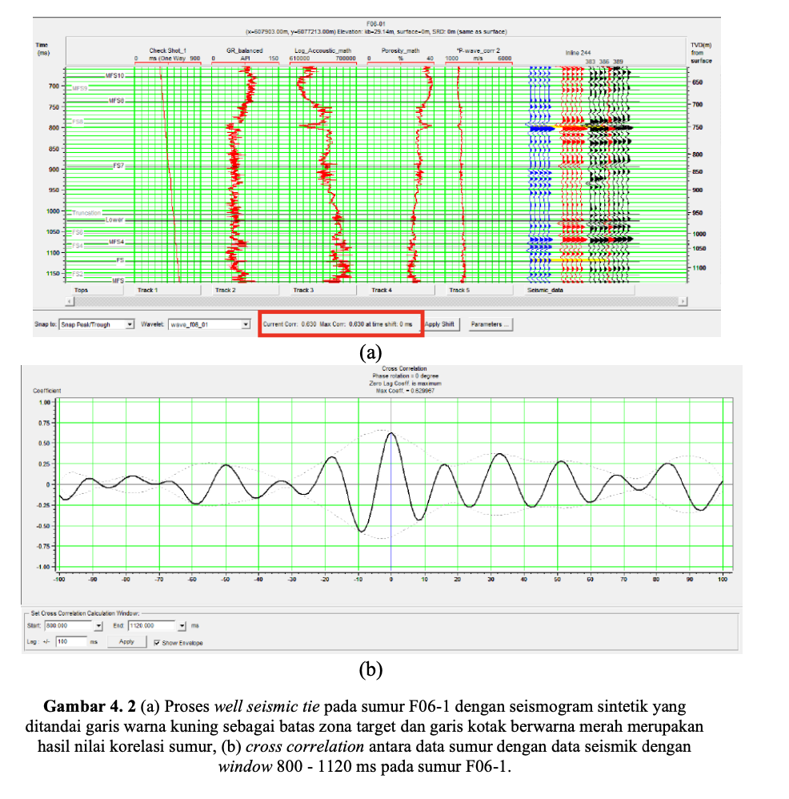
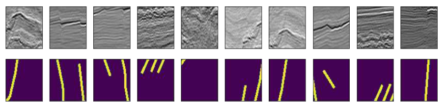
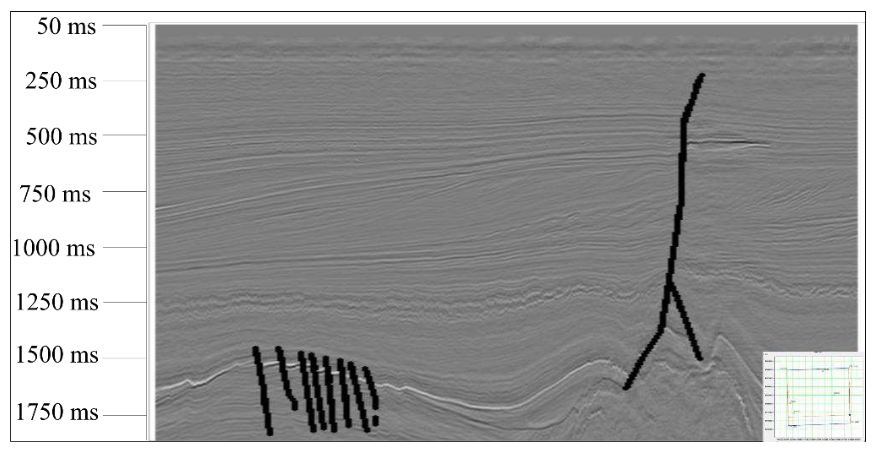
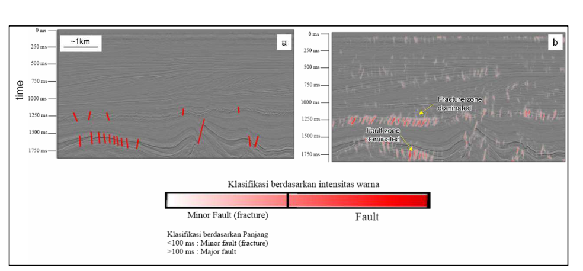
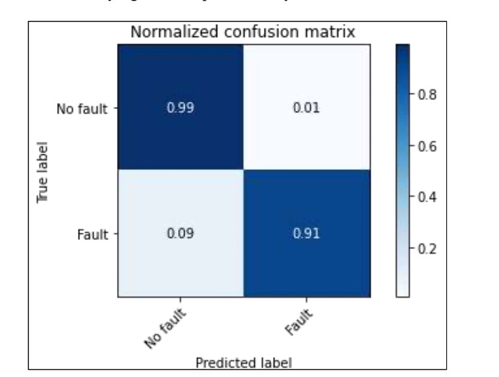

## Introduction
In the exploration and exploitation of hydrocarbons, various interdisciplinary studies are conducted and analyzed comprehensively to obtain as much information as possible about the physical properties and geometry of reservoir rocks beneath the surface. One of the key fields in this endeavor is geophysics, which plays a significant role in understanding subsurface structures. One of the most widely used geophysical methods is seismic reflection, which has been instrumental for decades in the global exploration of hydrocarbons.

The process of seismic data interpretation involves determining fault planes on 2D/3D seismic profiles, a task that typically requires considerable time and can be subject to uncertainty when performed manually using available software. This research focuses on using artificial intelligence, specifically Convolutional Neural Networks (CNN), to assist in the interpretation of seismic faults. The goal is to increase the efficiency of fault structure identification, providing better results in a shorter time frame.

The use of machine learning techniques, especially deep learning, has become more prevalent in recent years. In the early stages, traditional machine learning theories were employed to predict fault structures on seismic profiles, but these methods have evolved over time. In the 2010s, deep learning methods, such as CNN, have been utilized to tackle the complexities of fault identification with greater precision.

Seismic faults are significant in the context of hydrocarbon traps. These faults can act as barriers or migration pathways for hydrocarbons, influencing the formation of oil and gas reservoirs. By applying deep learning with CNN, this research aims to improve the analysis and identification of seismic fault structures more effectively and efficiently. The intention is to reduce the time needed to identify faults from raw seismic data and minimize biases introduced by human interpretation.

This study's research problem can be summarized into several key aspects:

The application of deep learning using the Extract, Transform, and Load (ETL) pipeline on 2D seismic data.
The preprocessing of training data to classify fault structures in seismic data.
The design and use of a U-Net deep learning architecture to optimally classify fault structures.
A comparison of fault interpretation results between manual methods and deep learning techniques.
The primary objective of this research is to identify fault structures both conventionally and through deep learning, assessing the effectiveness of fault labelling and predicting fault zones with high accuracy using deep learning techniques. Through this process, the study intends to demonstrate that deep learning can significantly improve the speed and precision of fault identification, offering valuable insights for the petroleum industry.

## Methodology

This study was conducted between December 2021 and December 2022 at the Institut Teknologi Sumatera, Lampung Selatan. The research methodology involved several critical steps to analyze seismic data and detect fault structures efficiently:

1. **Data Collection**: Seismic data from the F3 block in the North Sea was used, with a focus on 2D seismic profiles from inline 200 to 600.
2. **Data Preprocessing (ETL)**: The Extract, Transform, Load (ETL) process was applied to clean and prepare the seismic data, enabling it for further analysis.
3. **Wavelet Extraction**: A wavelet extraction technique was used to generate synthetic seismograms, which helped in understanding the seismic data’s underlying features and structure.
4. **Well-Seismic Tie**: The study integrated borehole data with seismic data to align geological and geophysical information, which is crucial for accurate depth determination in seismic profiles.
5. **Fault Picking**: The study compared traditional manual fault picking methods with automated fault detection using deep learning techniques, with an emphasis on efficiency and accuracy.
6. **Deep Learning Model**: The deep learning model used the U-Net architecture, a convolutional neural network (CNN), to perform segmentation and classification of seismic fault structures, offering a promising alternative to manual methods.

## Results and Discussion

The results from the application of deep learning to seismic data were analyzed and compared with traditional methods to assess the efficacy of automated fault detection.

1. **Well-Seismic Tie**: The results indicated a high correlation (greater than 0.6) between the well data and seismic data, ensuring a reliable well-seismic tie.
2. **Picking Faults**: Automated fault picking using deep learning showed superior performance in terms of speed and accuracy when compared to manual picking, making the process much more efficient.
3. **ETL and Training**: The data preprocessing using the ETL pipeline involved creating labeled seismic images, which were then split into 80% for training and 20% for validation. This process significantly improved the model’s predictive accuracy.
4. **Confusion Matrix and Model Performance**: The performance of the deep learning model was evaluated through a confusion matrix, where the model showed high precision and recall values, demonstrating its effectiveness in fault detection.
5. **Model Comparison**: A direct comparison between manual and automated methods highlighted the advantages of using deep learning, which resulted in faster and more accurate fault detection from seismic data.

These two chapters provide an in-depth discussion of the methodology used and the results obtained, demonstrating the potential of deep learning techniques to revolutionize the seismic fault interpretation process.
  
- **Images 1**: Well-seismic tie process for well F06-1, showing synthetic seismogram and correlation results.

- **Images 2**: Train Data on inline 300.

- **Images 3**: Conventional picking result on inline 300 using basemap.

- **Images 4**: Fault labelling using Inscape tools on inline 200 and result.

- **Images 4**: Confusion Matrix.

|              | Precision | Recall | F1-Score | Support |
|--------------|-----------|--------|----------|---------|
| **No Fault** | 1.00      | 0.99   | 0.99     | 3842    |
| **Fault**    | 0.85      | 0.93   | 0.89     | 254     |

[Visit Full My Thesis](https://drive.google.com/file/d/1aCOS6xNLegulN7gKdMzIYABqPhmVyytG/view?usp=sharing) to know full my thesis
