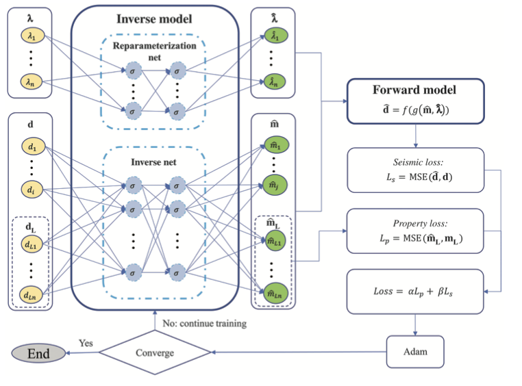
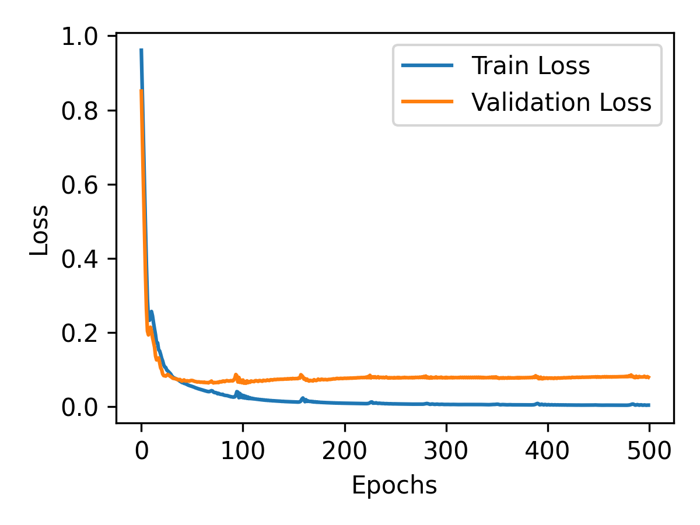
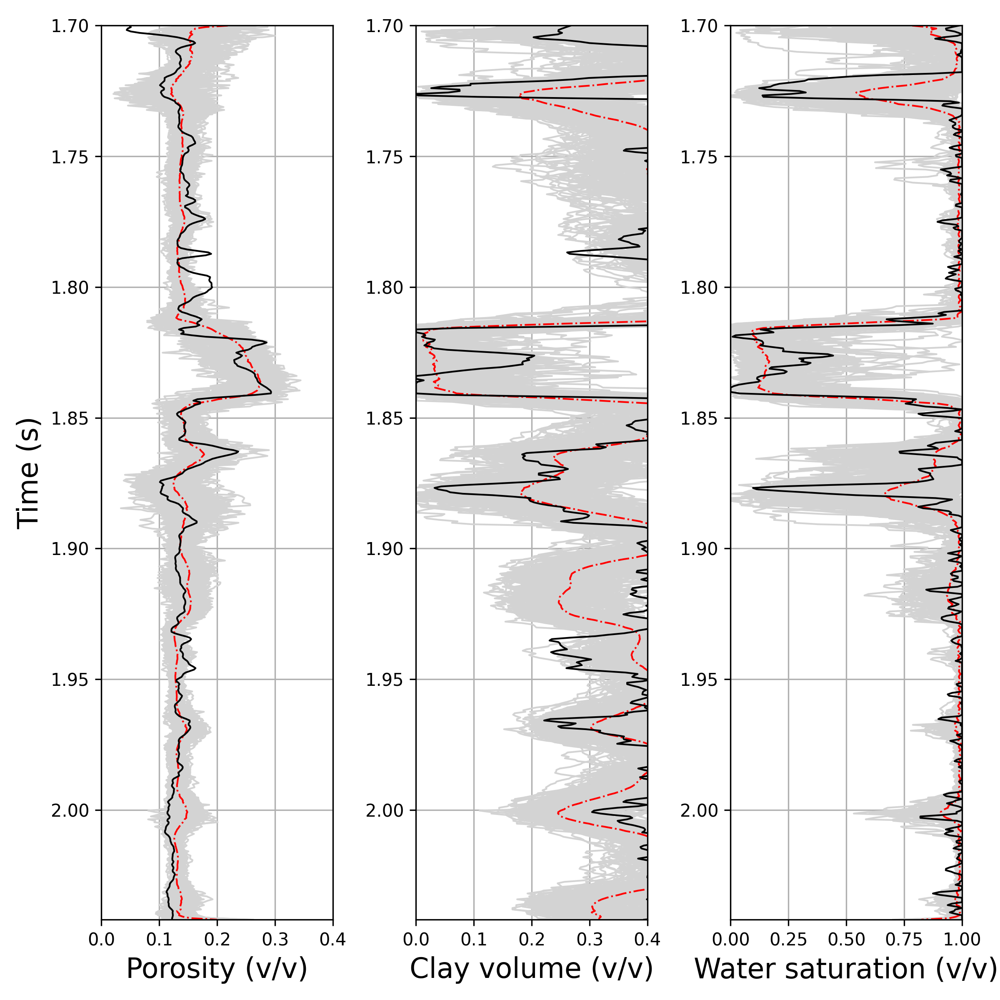
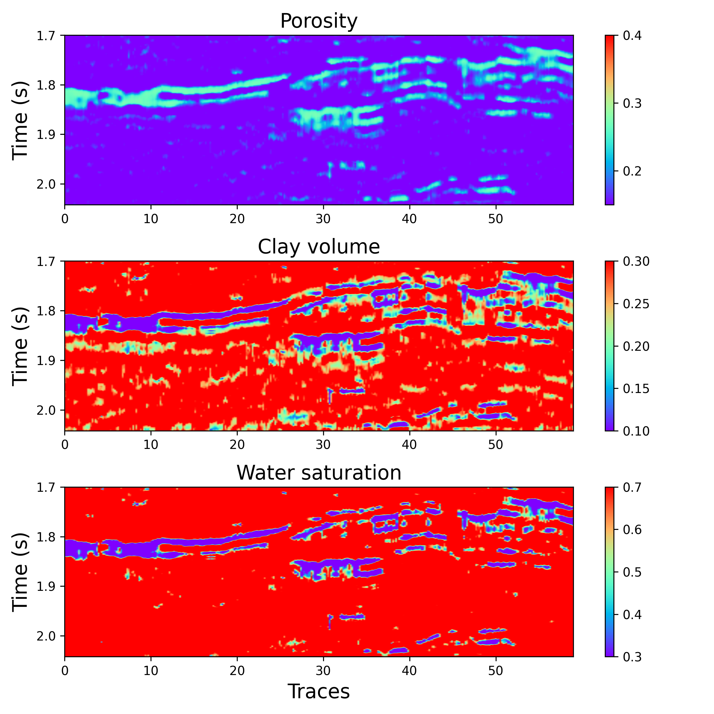

## Introduction
Seismic petrophysics inversion typically involves the prediction of subsurface properties like porosity and fluid volumes based on seismic data. Traditionally, this process involves multiple steps: first, inversion of seismic data to estimate velocities (through methods like acoustic inversion), and then using these velocities to predict petrophysical properties. The main limitation of these methods is that they often do not incorporate uncertainty quantification, leading to suboptimal predictions. Machine learning, and more specifically physics-informed neural networks (PINNs), offer an alternative by integrating data and physical models in the learning process, improving the estimation process. This paper aims to enhance this by introducing a probabilistic approach to PINNs.

The training will stop once the model reaches convergence, meaning the loss function is minimized to an acceptable level. If convergence is not achieved, the training process continues by further adjusting the model parameters.

## PINN Model Workflow:
   - Input Seismic Data (d): Observed seismic data is fed into the inverse model.
   - Inverse Model: Estimates the petrophysical properties and rock-physics model parameters.
   - Forward Model: Simulates seismic data (d̃) from the predicted properties.
   - Loss Calculation: Calculates the seismic loss (Ls) and the property loss (Lp), and computes the total loss.
   - Optimization: The model is optimized using the Adam optimizer to minimize the total loss.
   Training Loop: This process repeats until the model converges.

This PINN framework ensures that the predicted seismic data aligns with actual seismic data and that the estimated petrophysical properties are realistic, constrained by physical laws (i.e., rock-physics models). The addition of probabilistic components can further help with uncertainty quantification, enhancing model robustness.


```python
import torch
from torch.nn.functional import conv1d
from torch import nn, optim
import numpy as np
from core.Inversion import *
from core.RockPhysics import *
from torch.nn.functional import pad

device = 'cuda' if torch.cuda.is_available() else 'cpu'


class inverse_model(nn.Module):
    def __init__(self, in_channels, resolution_ratio=4, nonlinearity="tanh"):
        super(inverse_model, self).__init__()
        self.in_channels = in_channels
        self.activation = nn.Tanh() if nonlinearity == "relu" else nn.Tanh()
        self.c2 = 16  # 16

        self.cnn1 = nn.Sequential(nn.Conv1d(in_channels=self.in_channels,
                                            out_channels=self.c2,
                                            kernel_size=11,
                                            padding=5,
                                            dilation=1),
                                  nn.BatchNorm1d(self.c2),
                                  self.activation)

        self.cnn2 = nn.Sequential(nn.Conv1d(in_channels=self.in_channels,
                                            out_channels=self.c2,
                                            kernel_size=11,
                                            padding=5,
                                            dilation=1),
                                  nn.BatchNorm1d(self.c2),
                                  self.activation)

        self.cnn3 = nn.Sequential(nn.Conv1d(in_channels=self.in_channels,
                                            out_channels=self.c2,
                                            kernel_size=11,
                                            padding=5,
                                            dilation=1),
                                  nn.BatchNorm1d(self.c2),
                                  self.activation)

        self.cnn = nn.Sequential(nn.Conv1d(in_channels=3 * self.c2,
                                           out_channels=3 * self.c2,
                                           kernel_size=11,
                                           padding=5,
                                           dilation=1),
                                 nn.BatchNorm1d(3 * self.c2),
                                 self.activation,

                                 nn.Conv1d(in_channels=3 * self.c2,
                                           out_channels=2 * self.c2,
                                           kernel_size=11,
                                           padding=5,
                                           dilation=1),
                                 nn.BatchNorm1d(2 * self.c2),
                                 self.activation,

                                 nn.Conv1d(in_channels=2 * self.c2,
                                           out_channels=2 * self.c2,
                                           kernel_size=11,
                                           padding=5,
                                           dilation=1
                                           ),
                                 nn.BatchNorm1d(2 * self.c2),
                                 self.activation)

        self.gru = nn.GRU(input_size=self.in_channels,  # 1
                          hidden_size=self.c2,  # 4
                          num_layers=3,
                          batch_first=True,
                          bidirectional=True)

        self.up = nn.Sequential(nn.ConvTranspose1d(in_channels=2 * self.c2,
                                                   out_channels=self.c2,
                                                   stride=2,
                                                   kernel_size=2,
                                                   padding=1,
                                                   dilation=3,
                                                   output_padding=2),
                                nn.BatchNorm1d(self.c2),
                                self.activation,

                                nn.ConvTranspose1d(in_channels=self.c2,
                                                   out_channels=self.c2,
                                                   stride=2,
                                                   kernel_size=2,
                                                   padding=1,
                                                   dilation=3),
                                nn.BatchNorm1d(self.c2),
                                self.activation)

        self.gru_out = nn.GRU(input_size=self.c2,  #
                              hidden_size=self.c2,
                              num_layers=1,
                              batch_first=True,
                              bidirectional=True)

        self.out = nn.Linear(in_features=2 * self.c2, out_features=self.in_channels)
        
        self.dropout = nn.Dropout(p=0.2)

        nnr = 10 # number of neuron 10
        self.fc1 = nn.Linear(2,nnr)
        self.fc2 = nn.Linear(nnr, nnr)
        self.fc3 = nn.Linear(nnr,2)
                                   

        for m in self.modules():
            if isinstance(m, nn.Conv1d) or isinstance(m, nn.ConvTranspose1d):
                nn.init.xavier_uniform_(m.weight.data)
                m.bias.data.zero_()
            elif isinstance(m, nn.BatchNorm1d):
                m.weight.data.fill_(1)
                m.bias.data.zero_()
            elif isinstance(m, nn.Linear):
                m.bias.data.zero_()


        self.optimizer = optim.Adam(self.parameters(), 0.005, weight_decay=1e-8)

```

## Inverse Model (Neural Network)

The `inverse_model` class is a neural network architecture designed for **inverse seismic modeling**. It attempts to learn the relationship between **seismic data** and **petrophysical properties** (like porosity, clay content, and water saturation).

### **Network Components**:

- **CNN Layers**:  
  The network starts with three separate 1D convolution layers (`cnn1`, `cnn2`, `cnn3`), each with 16 channels, using a kernel size of 11. The convolution layers help extract high-level features from the seismic data by applying a sliding window (convolution) on the input data. These layers also include **Batch Normalization** to stabilize the learning process and an **activation function** (`Tanh`).

- **Concatenation of CNN Outputs**:  
  The outputs of the three convolution layers are concatenated and passed through another convolution layer, which combines these features to create a more comprehensive representation of the seismic data.

- **GRU Layer**:  
  A **Gated Recurrent Unit (GRU)** layer processes the temporal or sequential aspects of the seismic data. GRUs are effective at learning dependencies over time, which is important for time-series data such as seismic traces.

- **Upsampling (ConvTranspose)**:  
  The `up` layer consists of **transpose convolution layers** (also known as **deconvolutions**) that upsample the data to a higher resolution. This is done after the data has been processed through the GRU and CNN layers, improving its dimensionality and allowing for better feature reconstruction.

- **Output Layer**:  
  The final output layer is a GRU followed by a **fully connected (FC)** layer that produces the final predicted seismic data (`x`) and other estimated petrophysical properties (`z`). The network also includes **dropout regularization** to prevent overfitting.

```python
def forward(self, x,z):
        # x = pad(x, (1, 0), "constant", 0)
        cnn_out1 = self.cnn1(x)
        cnn_out2 = self.cnn2(x)
        cnn_out3 = self.cnn3(x)
        cnn_out = self.cnn(torch.cat((cnn_out1, cnn_out2, cnn_out3), dim=1))
        cnn_out = self.dropout(cnn_out)

        tmp_x = x.transpose(-1, -2)
        rnn_out, _ = self.gru(tmp_x)
        rnn_out = rnn_out.transpose(-1, -2)
        rnn_out = self.dropout(rnn_out)

        x = rnn_out + cnn_out
        x = self.up(x)
        x = self.dropout(x)

        tmp_x = x.transpose(-1, -2)
        x, _ = self.gru_out(tmp_x)

        x = self.out(x)
        x = x.transpose(-1, -2)

        z = self.fc1(z)
        z = self.dropout(z)
        z = self.fc2(z)
        z = self.dropout(z)
        z = self.fc3(z)
        z = torch.sigmoid(z)

        return x,z


class forward_model(nn.Module):
    def __init__(self, resolution_ratio=4, ):
        super(forward_model, self).__init__()
        self.resolution_ratio = resolution_ratio
        # self.criticalporo = 0.4
        # self.coordnumber = 7


    def forward(self, y, criticalporo,
                coordnumber):  # based on granular media theory+softsand+ aki-richard approximation, the shape of Phi,Vclay,Sw, should be [ns,nt]
        # m.shape = [nt,n,ns]
        # m[:,0] = Phi, m[:,1] = Vclay, m[:,2] = Sw,
        ## rock phsyics parameters
        # solid phase (quartz and clay)
        Kclay = 21
        Kquartz = 33
        Gclay = 15
        Gquartz = 36
        Rhoclay = 2.45
        Rhoquartz = 2.65
        # fluid phase (water and gas)
        Kwater = 2.25
        Kgas = 0.1
        Rhowater = 1.05
        Rhogas = 0.1
        patchy = 0
        # granular media theory parameters
        # criticalporo = self.criticalporo  # unknown parameters, reference value 0.4
        # coordnumber = self.coordnumber     # unknown parameters, reference value 7
        pressure = 0.02

        ## seismic parameters
        # angles
        theta = [15, 30, 45]
        # wavelet
        dt = 0.001
        freq = 45
        ntw = 64
        wavelet, _ = RickerWavelet(freq, dt, ntw)

        # solid and fluid phases
        y = y[..., ::self.resolution_ratio]
        ns = y.shape[2]
        nt = y.shape[0]
        Phi = y[:, 0].T
        Vclay = y[:, 1].T
        Sw = y[:, 2].T

        Kmat = torch.zeros([ns, nt])
        Gmat = torch.zeros([ns, nt])
        Rhomat = torch.zeros([ns, nt])
        Kfl = torch.zeros([ns, nt])
        Rhofl = torch.zeros([ns, nt])

        for i in range(nt):
            Kmat[:, i], Gmat[:, i], Rhomat[:, i], Kfl[:, i], Rhofl[:, i] = MatrixFluidModelTorch(
                torch.tensor([Kclay, Kquartz]),
                torch.tensor([Gclay, Gquartz]),
                torch.tensor([Rhoclay, Rhoquartz]),
                torch.hstack([Vclay[:, i].reshape(-1, 1), (1 - Vclay[:, i]).reshape(-1, 1)]),
                torch.tensor([Kwater, Kgas]),
                torch.tensor([Rhowater, Rhogas]),
                torch.hstack([Sw[:, i].reshape(-1, 1), (1 - Sw[:, i]).reshape(-1, 1)]),
                patchy)

        ## Density
        Rho = DensityModel(Phi, Rhomat, Rhofl)

        ## Soft sand model
        Vp, Vs = SoftsandModelTorch(Phi, Rho, Kmat, Gmat, Kfl, criticalporo, coordnumber, pressure)

        # Wavelet matrix
        nm = Vp.shape[0]
        ntheta = len(theta)

        W = WaveletMatrix(wavelet, nm, ntheta)
        W = torch.tensor(W).float()
        if torch.cuda.is_available():
            W = W.cuda()

        ## Seismic
        Snear = torch.zeros([ns - 1, nt])
        Smid = torch.zeros([ns - 1, nt])
        Sfar = torch.zeros([ns - 1, nt])
        for i in range(nt):
            Seis = SeismicModelAkiRichardTorch(Vp[:, i].reshape(-1, 1), Vs[:, i].reshape(-1, 1),
                                               Rho[:, i].reshape(-1, 1), theta,
                                               W)

            Snear[:, i] = Seis[:ns - 1].flatten()  # ns-1 not include acorrding to python role
            Smid[:, i] = Seis[ns - 1:2 * (ns - 1)].flatten()
            Sfar[:, i] = Seis[2 * (ns - 1):].flatten()

        d = torch.stack([Snear, Smid, Sfar], axis=1)
        d = d.permute(*torch.arange(d.ndim - 1, -1, -1))
        # SeisSyn = d[..., ::self.resolution_ratio]

        return d

```

## **Forward Model (Seismic Simulation)**

The `forward_model` class is responsible for simulating **seismic data** based on input **petrophysical properties** (`y`) and **rock physics parameters** (e.g., porosity, clay content, water saturation). It models the process of generating seismic data from physical rock properties.

### **Model Components**:

- **Rock Physics Model**:  
  The class contains physical constants for **rock** and **fluid** properties, including **bulk modulus**, **shear modulus**, **density**, and **porosity**. It uses the **granular media theory** and other rock physics models to simulate how seismic waves propagate through the medium.

- **Seismic Data Generation**:  
  The class includes a section for generating **synthetic seismic data** using the **Aki-Richards model**. The seismic data (`d`) is generated for different angles (denoted as `theta`) and uses a **Ricker wavelet** as the source signal.

- **Density and Velocity Models**:  
  The model computes **density (Rho)**, **velocity (Vp, Vs)**, and other key **petrophysical properties** based on the provided rock physics parameters (e.g., **critical porosity**, **coordination number**, **pressure).

- **Seismic Simulation**:  
  It generates seismic data (`d`) by simulating the **seismic wave propagation** through the medium. The synthetic seismic data is split into three different zones (**near**, **middle**, **far**) based on the **angle of incidence**. The seismic data (`d`) is then assembled into a final tensor representing the full synthetic dataset.

### **Forward Method**:
The `forward()` method takes the input `y` (which contains properties such as porosity, clay volume, and water saturation) and computes the seismic data using rock physics and the granular media theory. The model computes the seismic responses for different angles and stores them in a matrix `d`. This simulated data is then returned.

---

## **Summary of the Models' Purpose**:

- **Inverse Model**:  
  The `inverse_model` class learns to predict the **petrophysical properties** (like porosity, water saturation) from seismic data using deep learning. It combines **CNNs** and **GRUs** to extract and process the features in the seismic data, then uses **upsampling** to refine the output.

- **Forward Model**:  
  The `forward_model` class generates **synthetic seismic data** from petrophysical properties using rock physics models. It calculates the seismic response using physical parameters such as **density**, **porosity**, and **fluid content**. The synthetic seismic data is used to train the inverse model.


But, currently still developing for cases in Indonesia field . we used code by scratch from KAUST lab computation geophysics. However after this we tried and ran this program to know about the process between seismic and petrophysical inversion to tackle complex geophyical. We try and using HPC cluster with NVIDIA GPU for running 500 epoch almost 93 hours.





