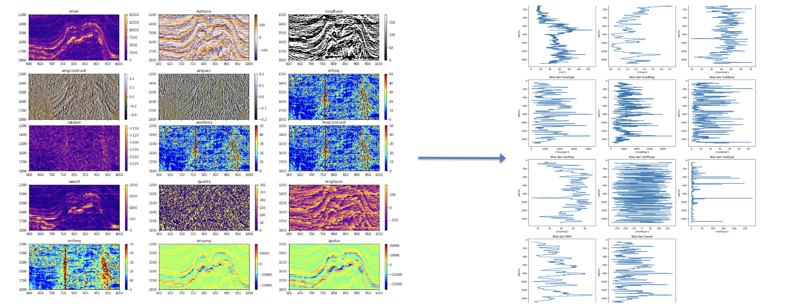
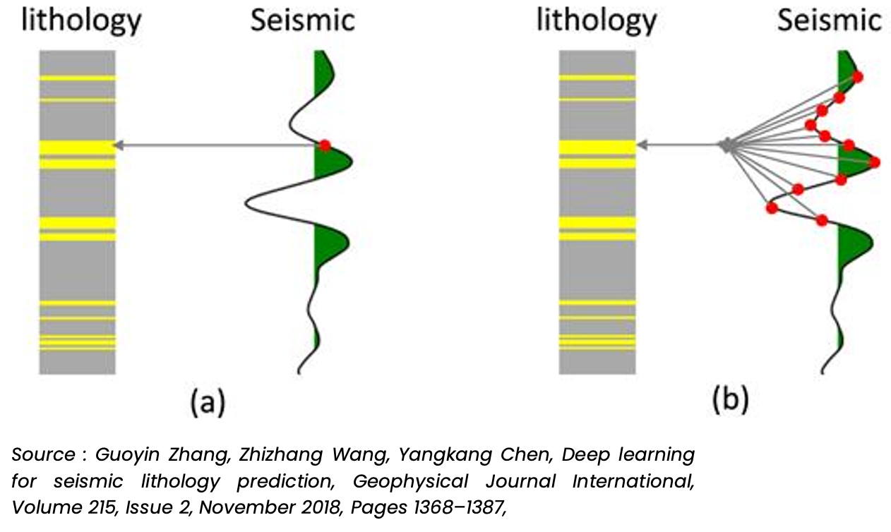
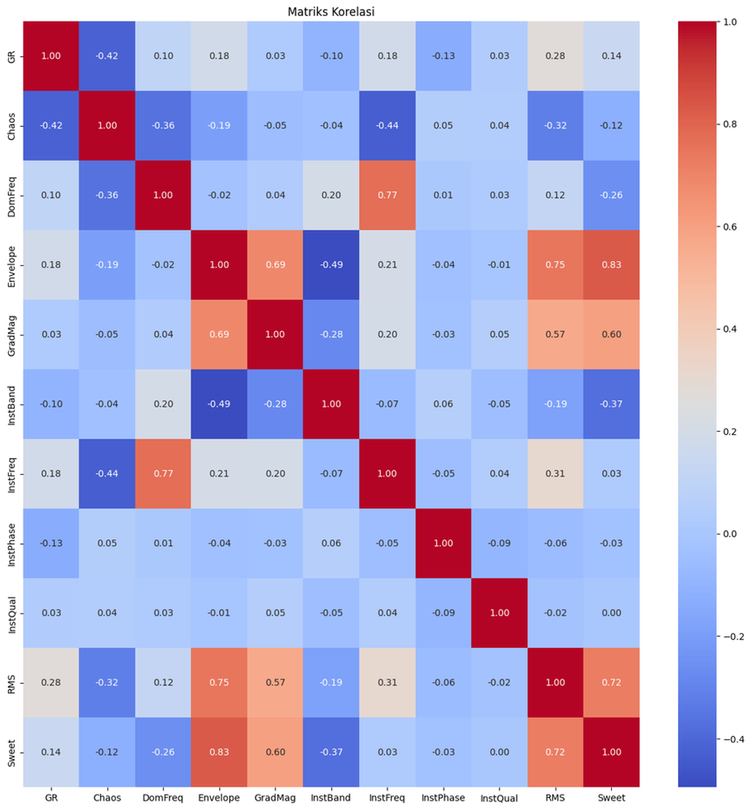
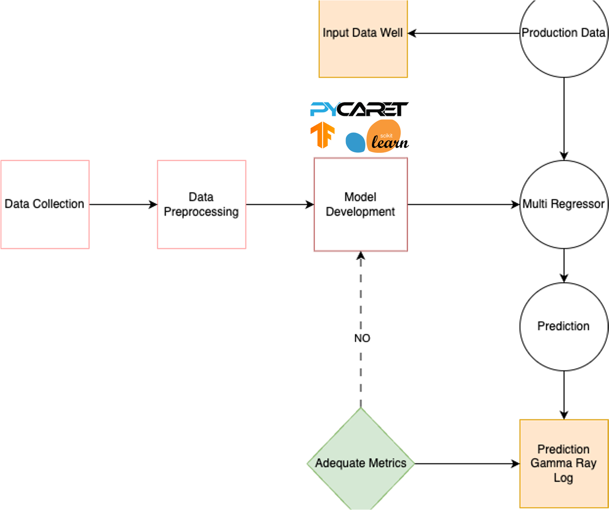
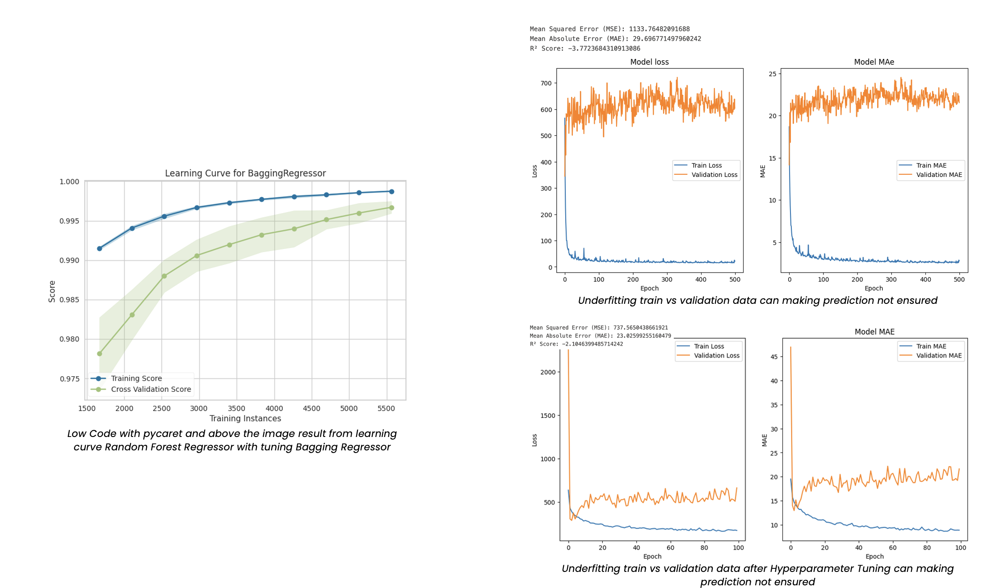
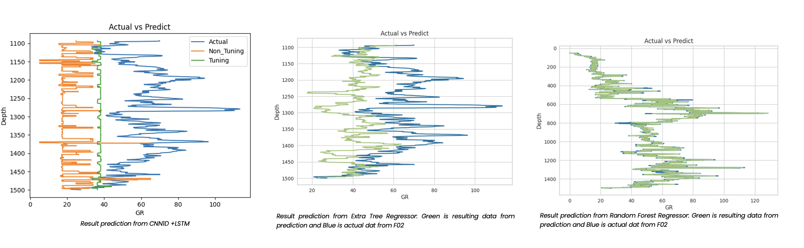
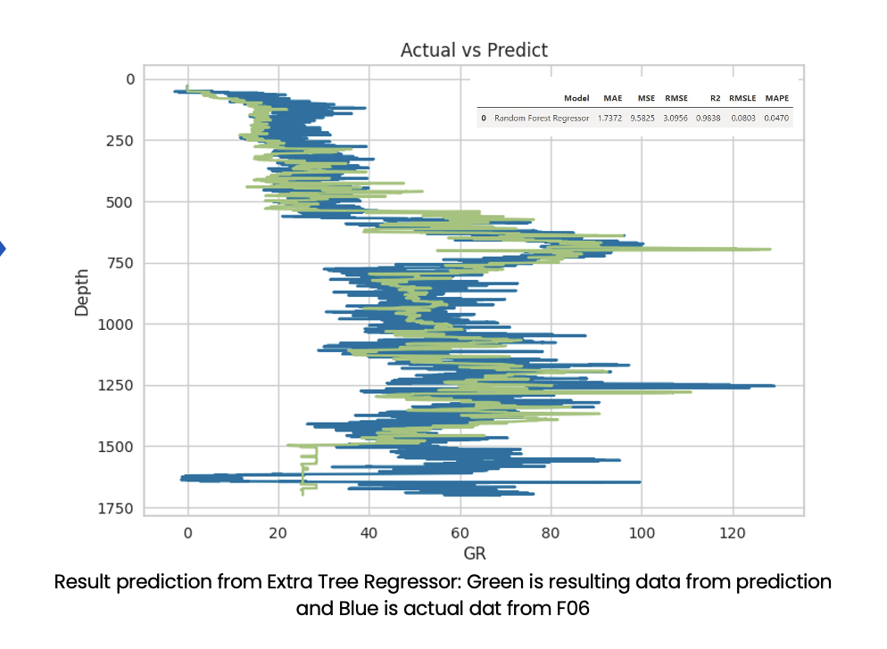

  
1. What is this website for?

This website is a place where I share my insights and writings related to software development with Dart and Flutter. It's also a platform to showcase my work in application development, allowing potential clients and collaborators to explore my portfolio and projects.

## Background
The focus of this presentation is how to utilize seismic data to predict gamma-ray logs or GR. These predictions play an important role in identifying lithologic characteristics, stratigraphy, sedimentary facies and hydrocarbon zones, especially in exploration areas that lack well data. However, the main challenge is the limited resolution of seismic data, which makes it difficult to identify thin layers or complex structures.

- **To develop a machine learning model that can accurately predict gamma-ray logs from 3D seismic data**  
- **Solving the limitations of seismic resolution by applying machine learning techniques that are able to identify complex patterns between seismic data and GR logs**
- **This aims to provide more accurate predictions in areas with limited well data.**

 
## Main
This study adopted machine learning and deep learning approaches
 - **CNN Models**
 - **Random Forest**
 - **K-Nearest Neighbour**

Retrieve opensource data from the web **https://terranubis.com/datainfo/F3-Demo-2023** owned by OpendTect project with 3D Seismic Data, Acoustic Impedance, Wells, Horizons. Then the data is selected and processed to become seismic attribute data. We were using seismic attirbute such as:

 - **Chaos**
 - **RMS Amplitudo**
 - **Envelope**
 - **Gradient Magnitude**
 - **Sweetness**
 - **Instaneous Frequency**
 - **Dominant Frequency**
 - **Instaneous Quality**
 - **Instaneous Bandwith**

After that, we continued to convert 3D Seismic data to only 1D data because how to know about correlations between trace data nearby from well logs. you can see image below, 

In this case, we’re predicting the GR log using post-stack seismic data. The lithology log has been converted to traveltime, matching the 2 ms sample rate of the seismic data. Getting the depth-to-time conversion right is super important because it directly impacts accuracy. 

CNNs have been widely used for solving different problems like image classification and speech recognition. In image classification, images are treated as 2D or 3D matrices, while in speech recognition, sound waves are converted into time-frequency spectra, which are then processed using convolution operations.

Just like sound wave spectra, seismic traces can also be transformed into time-frequency spectra. One way to do this is by using Continuous Wavelet Transforms (CWTs), which help analyze frequency variations in seismic data. These variations are key to detecting subtle changes in subsurface features, especially in thin layers. Since a CWT-generated seismic trace can be represented as a 2D map, it’s a great fit as an input for CNNs. After that based on correaltios matirix you can look image below to use everything logs because showing value correlations <0.5

## Value from this cases
- **The estimated cost of conducting a 3D seismic acquisition for 20 km² is approximately $1 million, while drilling a single well to a depth of 2 km costs approximately $700,000. Consequently, drilling is a costly and uncertain endeavor.**
- **To achieve the most optimal Gamma Ray Log results, predictions in the form of pseudo log data are utilized.**

One main Random Forest Regressor model, ExtraTree Regressor and  CNN Model  + LSTM 1D for the best prediction accuracy of the three models.
Models are updated periodically when new data becomes available (e.g., after new seismic surveys, additional wells are drilled, different study area).

At the start, the CNN-LSTM model was trained with default hyperparameters. As you can see from the graphs, the training loss (blue line) decreases quickly, suggesting the model is learning well on the training data. However, the validation loss (orange line) shows a very different behavior, which indicates underfitting—the model isn't generalizing well to new, unseen data. This is reflected in the large gap between the training and validation metrics. The Mean Squared Error (MSE) and Mean Absolute Error (MAE) values are high, with the MSE being over 1,100 and MAE being above 29.

Another key point is the R² score, which is negative (around -3.77). This means the model is performing worse than a simple mean-based baseline, indicating a serious problem in prediction quality. The high discrepancy between train and validation losses implies that the model has failed to capture important features of the validation data.

This early stage reflects that the model is too simple or poorly tuned for the task, causing poor performance on validation data. It’s not yet ready to make reliable predictions.

After adjusting the model's hyperparameters and re-training, things improved significantly. As shown in the graphs, the training loss (blue) and validation loss (orange) are now much closer to each other, indicating that the model is generalizing better and has moved away from underfitting. While there's still some fluctuation, it’s not as severe as in the previous model.

With this fine-tuned version, the MSE has dropped to about 737, and the MAE has decreased to approximately 23, showing a significant improvement in prediction accuracy. Although there's still a gap between training and validation metrics, the overall trend indicates that the model is learning more effectively and predicting with greater accuracy.

The R² score also improved, though it’s still negative, which suggests the model is still underperforming relative to a baseline but is certainly better than before. There’s still room for improvement, especially in terms of reducing validation loss fluctuations, but fine-tuning the hyperparameters has made the model much more robust and effective than the initial version.

The learning curve shown in the graph demonstrates the performance of the Bagging Regressor model with respect to the number of training instances you can see with two lines blue and green. This learning curve suggests that the Bagging Regressor is performing well on both the training and validation data, demonstrating solid generalization capability, which is likely due to the cross-validation process used by PyCaret.

## Actual vs Predicted Depth Comparison

The following plots compare the actual vs predicted depth (GR) values for three different models. Each plot shows the performance of the model in predicting depth based on the given dataset:

### 1. CNNID + LSTM Model (Left Plot)

- **Blue Line (Actual):** Represents the actual depth values from the dataset.
- **Orange Line (Non-Tuned Predictions):** Shows the predictions made by the CNNID + LSTM model before hyperparameter tuning. There is noticeable deviation from the actual values, indicating that the model needs further refinement.
- **Green Line (Tuned Predictions):** After fine-tuning, this line represents the predictions of the CNNID + LSTM model. While there is still some deviation, the green line is closer to the actual values compared to the orange line, indicating that tuning improved the model's performance, though it's still not perfect.

### 2. Extra Tree Regressor (Middle Plot)

- **Blue Line (Actual):** As in the previous plots, the blue line represents the true depth values.
- **Green Line (Predictions):** This line shows the predictions from the Extra Tree Regressor. Compared to the CNNID + LSTM model, the predictions from the Extra Tree Regressor are much closer to the actual values, demonstrating a better fit to the data with less deviation.

### 3. Random Forest Regressor (Right Plot)

- **Blue Line (Actual):** The true depth values are represented by the blue line.
- **Green Line (Predictions):** The green line shows the predictions from the Random Forest Regressor. Similar to the Extra Tree Regressor, the Random Forest model's predictions are very close to the actual values, indicating high accuracy and a strong predictive ability.

### Summary

- The **CNNID + LSTM model** shows improvement after hyperparameter tuning but still has noticeable gaps compared to the actual values, suggesting that it could benefit from further optimization.
- Both the **Extra Tree Regressor** and **Random Forest Regressor** show better performance, with predictions much closer to the actual values. These models provide more stable and accurate results compared to the CNNID + LSTM model.
- In conclusion, the tree-based models (Extra Tree and Random Forest) appear to outperform the CNNID + LSTM model for this particular task.

## Deploy
After deployment, the performance of the system is evaluated using existing data. Metrics such as MSE, MAE, R², RMSLE, and MAPE are monitored to ensure the accuracy and reliability of the system. We choose data testing in well F-06 you can see the table like that :

The table below presents the performance metrics for the **Random Forest Regressor** model:

| Model                    | MAE   | MSE    | RMSE   | R2    | RMSLE  | MAPE   |
|--------------------------|-------|--------|--------|-------|--------|--------|
| Random Forest Regressor   | 1.7372| 9.5825 | 3.0956 | 0.9838| 0.0803 | 0.0470 |

### Metric Descriptions:
- **MAE (Mean Absolute Error):** The model's average error magnitude is 1.7372, which shows the average difference between the predicted and actual values.
- **MSE (Mean Squared Error):** The squared average of the errors is 9.5825, which gives an idea of the variance of the model errors.
- **RMSE (Root Mean Squared Error):** The square root of MSE is 3.0956, providing a more interpretable scale of the error.
- **R² (R-Squared):** This value is 0.9838, indicating that the model explains 98.38% of the variance in the data, demonstrating excellent fit.
- **RMSLE (Root Mean Squared Logarithmic Error):** The RMSLE is 0.0803, which is typically used for data that involves exponential growth.
- **MAPE (Mean Absolute Percentage Error):** With a value of 0.0470, this represents the model's prediction

After this the result like this :

## Conclusions

The findings of this research suggest that ML techniques, particularly Random Forest, CNN, can significantly enhance the prediction of GR logs from seismic data, providing a valuable tool for subsurface characterization in hydrocarbon exploration. This approach can be used as a benchmark for future studies and field development

